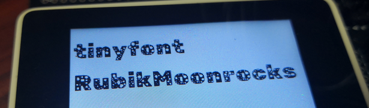

TinyFont
=========

TinyFont is a font/text package for [TinyGo](https://tinygo.org/) displays. It is heavily based on [Adafruit's GFX library](https://github.com/adafruit/Adafruit-GFX-Library).

This package is experimental and may change in the future. It has not been optimized for speed or memory..

## Faster compilation
During compilation, tinygo will go through all the font files in a package and them discard them if not used. To improve compilation time considerably, move the files you are going to use to a new package. 

## About the fonts
The fonts compiled here were just converted or made compatible, and the original authors should be given proper credit. Each font is under its own license, and while most of them are under an _open license_, there might be differences in its usage and conditions.

## Generate your own font

You can use tinyfontgen to generate a tinyfont from a bdf/ttf font.  

https://github.com/tinygo-org/tinyfont/tree/release/cmd/tinyfontgen  
https://github.com/tinygo-org/tinyfont/tree/release/cmd/tinyfontgen-ttf  

## Incompatibility warning

This package contains incompatible changes from [previous versions](https://github.com/tinygo-org/tinyfont/commit/a02e4495f8d64b671d923ec009e17c9da9e3e7f5).

* The argument has been changed from []byte to string.
  * You can simply add a string() cast.
* The Font struct has been changed.
  * If you are creating your own fonts, you need to modify them.
  * You may find [this script](https://github.com/sago35/tinyfont/tree/fontconv/cmd/tinyfontconv) helpful for font conversion.

## License

[This project is licensed](./LICENSE) under the BSD 3-clause license, just like the [Go project](https://golang.org/LICENSE) itself.
