TinyFont
=========

TinyFont is a font/text package for [TinyGo](https://tinygo.org/) displays. It is heavily influenced by [Adafruit's GFX library](https://github.com/adafruit/Adafruit-GFX-Library).

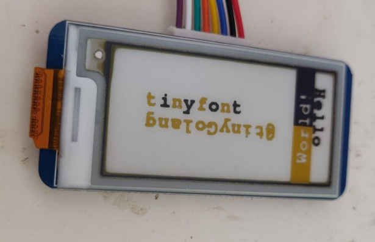
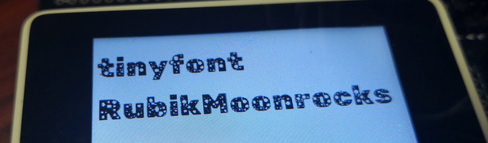

This package is experimental and may change in the future. It has not been optimized for speed or memory.

## Current Fonts

### freemono

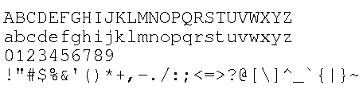

A monospaced serif font from the GNU FreeFont project. Available in regular, bold, oblique, and bold oblique styles at 9, 12, 18, and 24pt. Licensed under GPL v3.

### freesans

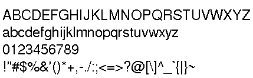

A sans-serif font from the GNU FreeFont project. Available in regular, bold, oblique, and bold oblique styles at 9, 12, 18, and 24pt. Licensed under GPL v3.

### freeserif

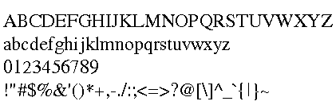

A proportional serif font from the GNU FreeFont project. Available in regular, bold, italic, and bold italic styles at 9, 12, 18, and 24pt. Licensed under GPL v3.

### gophers

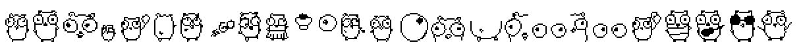

A decorative font featuring Go gopher-themed glyphs, created by @rakyll. Available at 14, 18, 22, 32, 58, and 121pt. Licensed under CC BY-NC 4.0.

### notoemoji

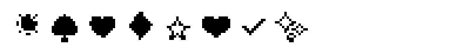

Google's Noto Emoji font, providing a wide range of emoji glyphs. Available at 12, 16, and 20pt. Licensed under SIL Open Font License.

### notosans

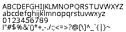

Google's Noto Sans font, designed to support text in all languages with a clean sans-serif appearance. Available at 12pt. Licensed under SIL Open Font License.

### proggy

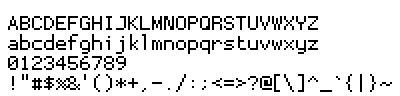

The classic Proggy programming font, a pixel-perfect monospaced bitmap font well suited for small displays. Available at 8pt.

### shnm

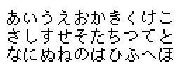

The Shinonome (東雲) bitmap font family, a Japanese BDF bitmap font supporting Latin and JIS character sets. Available at 12pt. Licensed under a permissive open license from The Electronic Font Open Laboratory.

### org_01

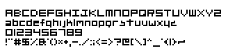

Org_v01 by Orgdot. A tiny, stylized font with all characters fitting within a 6-pixel height.

### picopixel

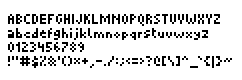

Picopixel by Sébastien Matos. A tiny pixel font with all characters fitting within a 6-pixel height.

### tiny3x3a2pt7b

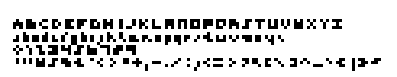

"Tiny3x3a" from FontStruct by Michaelangel007. An extremely compact 3×3 pixel font. Licensed under CC BY-NC-SA 3.0.

### tomthumb

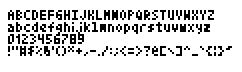

Tom Thumb, a 3×5 pixel monospaced bitmap font originally by Brian J. Swetland. One of the smallest legible fonts available. Licensed under the BSD 3-Clause License.

## About the fonts

The fonts compiled here were just converted or made compatible, and the original authors should be given proper credit. Each font is under its own license, and while most of them are under an _open license_, there might be differences in its usage and conditions.

## Generate your own font

You can use tinyfontgen to generate a tinyfont from a bdf/ttf font.  

https://github.com/tinygo-org/tinyfont/tree/release/cmd/tinyfontgen  
https://github.com/tinygo-org/tinyfont/tree/release/cmd/tinyfontgen-ttf  

## Faster compilation

During compilation, tinygo will go through all the font files in a package and them discard them if not used. To improve compilation time considerably, move the files you are going to use to a new package.

## Incompatibility warning

This package contains incompatible changes from [previous versions](https://github.com/tinygo-org/tinyfont/commit/a02e4495f8d64b671d923ec009e17c9da9e3e7f5).

* The argument has been changed from []byte to string.
  * You can simply add a string() cast.
* The Font struct has been changed.
  * If you are creating your own fonts, you need to modify them.
  * You may find [this script](https://github.com/sago35/tinyfont/tree/fontconv/cmd/tinyfontconv) helpful for font conversion.

## License

* Program code: Licensed under the BSD 3-Clause License, same as the Go project.
* Fonts: Each font is licensed under its own terms. Some allow commercial use, others (e.g., CC BY-NC, GPL) have restrictions.

Please check the license file in each font's directory before use, especially for commercial projects.

