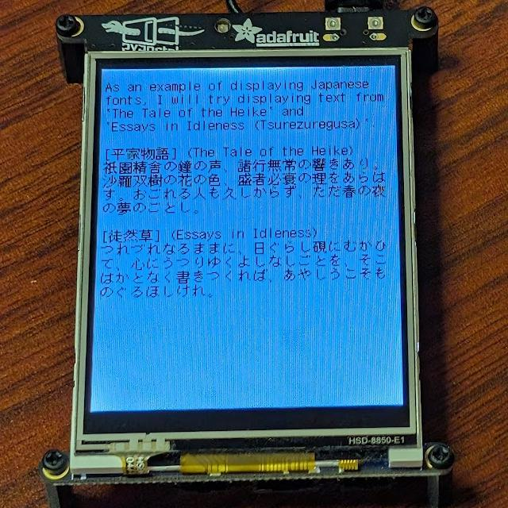

# const1bit

Testing with pyportal.  

```
$ tinygo build -o app.uf2 -target pyportal -size short ./examples/const1bit/
```



The font was created as follows.  

```
tinyfontgen --all --fontname shnmk12 --package shnmk12 --output ./shnmk12.go --verbose ./shnm6x12r.bdf ./shnmk12.bdf --yadvance 13
```

You can download the original BDF font used with tinyfontgen from the following link. Please refer to the downloaded file for the license and other details.  

* http://openlab.ring.gr.jp/efont/shinonome/
