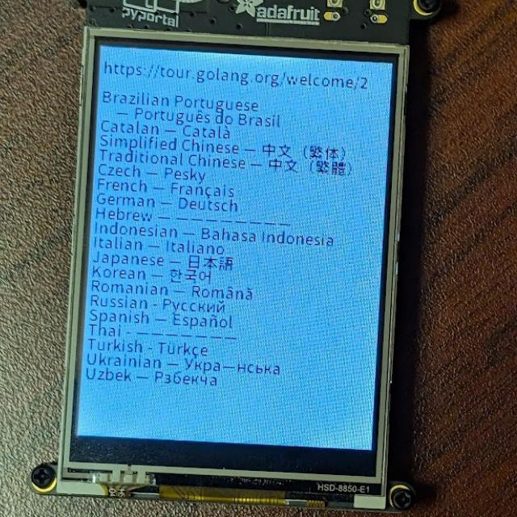

# unicode\_font3\_const

Testing with pyportal.  

```
$ tinygo build -o app.uf2 -target pyportal -size short ./examples/unicode_font3_const2bit
```



The font was created as follows.  

```
tinyfnotgen-ttf --size 12 --verbose --output ./font.go --string-file ./main.go --package main --fontname Notosans12pt ./NotoSansJP-Regular.otf ./NotoSansKR-Regular.ttf
```

You can download the original TTF/OTF fonts used with tinyfontgen-ttf from the following link. Please refer to the downloaded file for the license and other details.  

* https://fonts.google.com/noto/specimen/Noto+Sans+JP
* https://fonts.google.com/noto/specimen/Noto+Sans+KR
